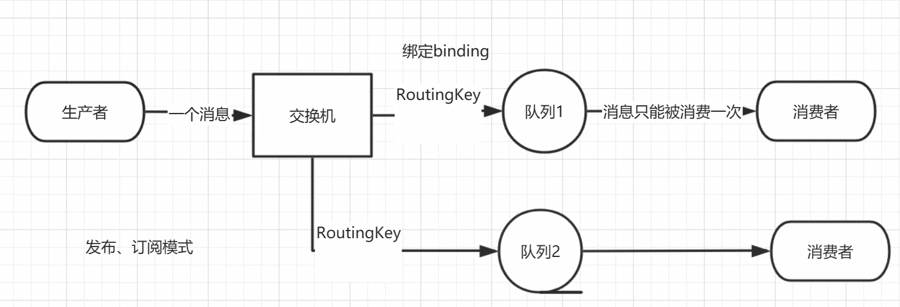

# Rabbit
#### one 普通测试
#### two 轮询分发
    - 当消费者有两个或两个以上时则会默认变成轮询分发模式
#### three 手动应答
    - 手动应答：再消费者收到消息后必须手动应答RabbitMQ才能去将信息删除
    - 自动应答：只要消费者接收到消息则RabbitMQ即将消息删除
    - 在消费者接收消息时 将第二个参数改为 false(false:手动应答 true:自动应答)
  java
//将设置修改为手动应答 (参数2为 false)
channel.basicConsume(QUEUE_NAME, false ,deliverCallback,cancelCallback);

//修改手动应答后 接受消息需要应答
DeliverCallback deliverCallback = (consumerTag,message)->{
 SleepUtil.sleep(1);
 System.out.println("接收到消息："+new String(message.getBody()));
  /**
  * 手动应答
  * 1.消息的标记 tag
  * 2.是否批量应答 false:不批量应答  true:批量应答信道中的消息
    */
    channel.basicAck(message.getEnvelope().getDeliveryTag(),false);
    };
#### Rabbit 消息分发
> 不公平分发 

    在rabbitMQ中默认的分发模式为轮询分发可能导致效率低下，修改为不公平分发则可以根据能者多劳的实现
    - 在消费者中修改
    - 设置不公平分发 在消费者接受消息前 设置basicQos参数为1 默认为0(公平分发)
    channel.basicQos(1);
> 预取值

    设置消费者
    - 预取值给每个消费者设置获取的对应的数量 可以根据手工根据性能设置每个消费者可以获取的数量
    - 设置预取值 在消费者接受消息前 设置(basicQos)对应消费者要消费的数量
    channel.basicQos( n );

#### four 发布确认
    - 在rabbitMQ中保证消息不丢失仅仅靠队列持久化和消息持久化是无法保证的消息不丢失的，因为生产者在发送消息
    给rabbitmq时还没来得及持久化就宕机了也会导致消息丢失，为了更高效率的消息不丢失还需要开启发布确认功能
    - 在生产者中设置
    //开启发布确认 (在发布消息前开启)
    channel.confirmSelect();
      - 单个确认发布  每发送一次即等待确认(同步确认)，如果没有接受到确认及不会发送第二条
        缺点：特别慢，因为是同步所以必须等待确认才会再次发送
      - 批量确认发布  可以指定没发布几次就进行确认 但是如果出现错误则不知道出现错误的消息是那一条
      - 异步批量发送  可以实现异步批量发送可以定制成功个失败的消息处理 效率高于前两个模式

#### five 发布订阅模式
发布订阅模式即 生产者发送消息到交换机 > 然后又交换机将消息发放到队列 则  消费者就可以拿到消息了 


> 生产者
```java
public class EmitLog {
    public static final String EXCHANGE_NAME = "logs";

    public static void main(String[] args) throws Exception{
        Channel channel = RabbitMQUtil.getChannel();
        /**
         * 消费者先开启 开启后就已经创建了交换机 所以这里不需要在创建交换机
         */
        //channel.exchangeDeclare(EXCHANGE_NAME,"fauout");//创建交换机
        Scanner scanner = new Scanner(System.in);
        while (scanner.hasNext()){
            String message = scanner.next();
            channel.basicPublish(EXCHANGE_NAME,"",null,message.getBytes("UTF-8"));
            System.out.println("消息"+message+"发送成功!");
        }
    }
}
```
> 消费者 （消费者代码相似）
```java
public class logs1 {
    //声明交换机的名称
    public static final String EXCHANGE_NAME = "logs";
    public static void main(String[] args) throws Exception{
        Channel channel = RabbitMQUtil.getChannel();
        //声明一个交换机
        channel.exchangeDeclare(EXCHANGE_NAME,"fanout");
        //声明一个临时队列
        /**
         * 生成一个临时队列 断开连接后自动销毁
         */
        String queue = channel.queueDeclare().getQueue();
        /**
         * 绑定交换机和队列
         */
        DeliverCallback deliverCallback = (consumerTag,message)->{
            System.out.println("接受到消息"+new String(message.getBody()));
        };
        channel.queueBind(queue,EXCHANGE_NAME,"");
        System.out.println("一号消费者等待接受消息............");
        channel.basicConsume(queue,true,deliverCallback,consumerTag -> {});
    }
}
```


#### 处理发布确认后未确认的消息
    - 为了获取未确认的消息我们先使用一个集合将我们发送的消息给存储起来 然后在确认中将确认的消息
    进行删除 剩下的则是未确认的消息
    //创建适用于高并发的集合
    ConcurrentSkipListMap<Long, Object> skipListMap = new ConcurrentSkipListMap<>();
    //在发送消息时将消息给存储起来
    for (int i = 1; i <= message_count; i++) {
      channel.basicPublish("",queueName,null,(i+"").getBytes());
      skipListMap.put(channel.getNextPublishSeqNo(),i+"");
    }
    //在消息确认方法函数中进行删除缺的数据  上下的即是未确认的数据
    ConfirmCallback ackCallback = (deliveryTag,multiple) -> {
         if(multiple){
             //删除发送成功后的消息   剩下的则是未确认的消息
             ConcurrentNavigableMap<Long, Object> headMap = skipListMap.headMap(deliveryTag);
             headMap.clear();
         }else{
             skipListMap.remove(deliveryTag);
         }
         //监听成功的回调
         System.out.println("确认的消息"+deliveryTag);
     };
     //可以在未确认的函数中获取
     ConfirmCallback nackCallback = (deliveryTag,multiple) ->{
         String o =(String) skipListMap.get(deliveryTag);
         System.out.println("未确认的消息:"+o);
         //监听失败的回调
         System.out.println("未确认的消息Tag"+deliveryTag);
     };

#### RabbitMQ 持久化
    - 在生产者中修改 -
    -消息持久化(将消息保存在磁盘上)
    在发送消息的第三个参数修改为 MessageProperties.PERSISTENT_TEXT_PLAIN
    channel.basicPublish("",QUEUE_NAME,MessageProperties.PERSISTENT_TEXT_PLAIN,next.getBytes("UTF-8"));
    -队列持久化(将队列存储在磁盘中)
    在创建队列时将第二个参数改为 true
    channel.queueDeclare(QUEUE_NAME,true,false,false,null);
#### util 创建信道工具类
    -  RabbitMQUtil 简化重复代码
    -  SleepUtil  设置程序休息时间工具(/s)

